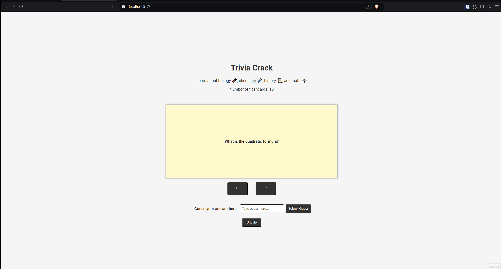

# Web Development Project 2 - *Flashcards*

Submitted by: **Ali Hamad**

This web app: **Trivia Crack Questions**

Time spent: **11** hours spent in total

## Required Features

The following **required** functionality is completed:

- [X] **The title of the card set and some information about it, such as a short description and the total number of cards are displayed**
- [X] **A single card at a time is displayed, only showing one of the components of the information pair**
- [X] **A list of card pairs is created**
- [X] **Clicking on the card shows the corresponding component of the information pair**
- [X] **Clicking the next button displays a random new card**
- Part 2 **required** features
  - [X] **The user can enter their guess in a box before seeing the flipside of the card**
  - [X] **Clicking on a submit button shows visual feedback about whether the answer was correct or incorrect**
  - [X] **A back button is displayed on the card and can be used to return to the previous card in a set sequence**
  - [X] **A next button is displayed on the card and can be used to navigate to the next card in a set sequence**

The following **optional** features are implemented:

- [ ] Cards contains images in addition to or in place of text
- [ ] Cards have different visual styles such as color based on their category
  - [ ] *visual style implemented*
- Part 2 **optional** features
  - [X] A shuffle button is used to randomize the order of the cards
  - [X] A user's answer may be counted as correct even when it is slightly different from the target answer
  - [ ] A counter displays the user's current and longest streak of correct responses
  - [ ] A user can mark a card that they have mastered and have it removed from the pool of answers as well as added to a list of mastered cards

The following **additional** features are implemented:

* [ ] List anything else that you added to improve the site's functionality!

## Video Walkthrough

Here's a walkthrough of implemented required features:

<!-- Replace this with whatever GIF tool you used! -->
GIF created with [ScreenToGif](https://imgur.com/gallery/flashcard-part-2-roJ9T9V)

## Notes

1. I had an issue with the background image covering properly so I used [W3Schools](https://www.w3schools.com/howto/howto_css_full_page.asp) as a reference to make a full height image.

2. Another challenge I came across was changing the elements of the page when showing the front or back of the page. On click, I wanted to switch the front and back. I initially just return the content as HTML in the function but that didn't work properly. So, I instead used the ternary operator within the JSX of my Flashcard component. If the isFront is true, it calls the function getQuestion(), else it calls the function getAnswer().

3. Part 2 - I wanted to figure out fuzzy matching, so I searched up fuzzy matching in my browser, and came across 2 algorithms, Levensthein Distance and Jaro Similarity. I briefly looked at both and decided to go with Jaro Similarity since it didn't look at complicated to implement. I spent a good portion of my time working on implementing the Jaro Similarity algorithm. It was a lots of work, I did lots of debugging, but eventually from some breakthoughs after taking some breaks here and there, it worked out! Here are 2 sources I used to better understand the algorithm. [Wikipedia](https://en.wikipedia.org/wiki/Jaro%E2%80%93Winkler_distance) and [GeeksForGeeks](https://www.geeksforgeeks.org/jaro-and-jaro-winkler-similarity/).

4. Part 2 - Regarding the back and previous buttons, I wanted to make my random generation of cards better. Instead of a randIndex that I call everytime I click the nextCard button, I wanted to make an array of random numbers that are all unique and fall within 0-9. At first, I used a while loop to keep generating a new number until the new number was unique and wasn't in the random array I created. However, that was not efficient and it made my page not load and just show white. The logic could be improved. Afer a quick break and some food, I went back to the drawing board and I came up with a validNumbers array that contain in order the numbers 0-9. I wanted to somehow choose one of these number to push onto an array for my random indices. Then, I would remove that number. I didn't have the idea fully hashed out so I first added the randomly generated index from my Math.random() function to my randomIndexArray. However, that doesn't work because then I could get recurring numbers. So I took a step back, and realized I need to generate a random number between 0-9, use that number to index into the validNumbers array, and push the element itself from validNumbers onto my randomIndexArray. Then, I could just splice the array and remove the element in validNumbers at that index to ensure uniqueness.

5. Part 2 - A smaller challenge I had was in my getAnswer() and getQuestion() functions. I was using the currentIndex state variable to start my flashcard set off. However, currentIndex always starts at 0 so it would be the same flashcard everytime since I would be indexing into the flashcard array itself where my flashcards are stored. I need to first get the randomIndex by indexing into my randomIndexArray WITH the currentIndex. Then, I could use the randomIndex to index into my flashcards array to get a random index everytime. 

6. Part 2 - As I was looking over my jaro similarity algorithm, I came across some few logic errors. I'll group them all into this bullet. In my if statement for checking the upperbound for the inner for loop, I need to have greater than or equal to, not just greater than when checking the second strings length. Also, I realized when I was debugging and running inspect in the web browser that sometimes the matched characters was greater than the number of characters in my input string. That's not right. You can only every have one matched character for the input when comparing against the answer. For example, lets say you have the answer 'dan' and input 'ddn'. If you already matched the 'd' at index 0 of the input, you can't use it again. So, I added each matched character in the input to an array of matched character indices. That way, I can check if the current jth index for checking the input is already in that array, then I won't count it as a matched characer since it was already matched.

## License

    Copyright [2024] [Ali Hamad]

    Licensed under the Apache License, Version 2.0 (the "License");
    you may not use this file except in compliance with the License.
    You may obtain a copy of the License at

        http://www.apache.org/licenses/LICENSE-2.0

    Unless required by applicable law or agreed to in writing, software
    distributed under the License is distributed on an "AS IS" BASIS,
    WITHOUT WARRANTIES OR CONDITIONS OF ANY KIND, either express or implied.
    See the License for the specific language governing permissions and
    limitations under the License.