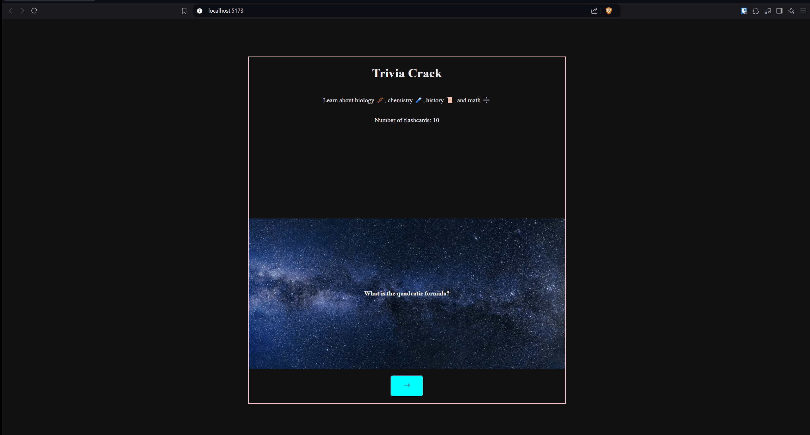

# Web Development Project 2 - *Flashcards*

Submitted by: **Ali Hamad**

This web app: **Trivia Crack Questions**

Time spent: **3** hours spent in total

## Required Features

The following **required** functionality is completed:

- [X] **The title of the card set and some information about it, such as a short description and the total number of cards are displayed**
- [X] **A single card at a time is displayed, only showing one of the components of the information pair**
- [X] **A list of card pairs is created**
- [X] **Clicking on the card shows the corresponding component of the information pair**
- [X] **Clicking the next button displays a random new card**

The following **optional** features are implemented:

- [ ] Cards contains images in addition to or in place of text
- [ ] Cards have different visual styles such as color based on their category
  - [ ] *visual style implemented*

The following **additional** features are implemented:

* [ ] List anything else that you added to improve the site's functionality!

## Video Walkthrough

Here's a walkthrough of implemented required features:

<!-- Replace this with whatever GIF tool you used! -->
GIF created with [ScreenToGif](https://imgur.com/gallery/project-2-flashcards-part-1-KfMgeTh)

## Notes

1. I had an issue with the background image covering properly so I used [W3Schools](https://www.w3schools.com/howto/howto_css_full_page.asp) as a reference to make a full height image.

2. Another challenge I came across was changing the elements of the page when showing the front or back of the page. On click, I wanted to switch the front and back. I initially just return the content as HTML in the function but that didn't work properly. So, I instead used the ternary operator within the JSX of my Flashcard component. If the isFront is true, it calls the function getQuestion(), else it calls the function getAnswer().

## License

    Copyright [2024] [Ali Hamad]

    Licensed under the Apache License, Version 2.0 (the "License");
    you may not use this file except in compliance with the License.
    You may obtain a copy of the License at

        http://www.apache.org/licenses/LICENSE-2.0

    Unless required by applicable law or agreed to in writing, software
    distributed under the License is distributed on an "AS IS" BASIS,
    WITHOUT WARRANTIES OR CONDITIONS OF ANY KIND, either express or implied.
    See the License for the specific language governing permissions and
    limitations under the License.